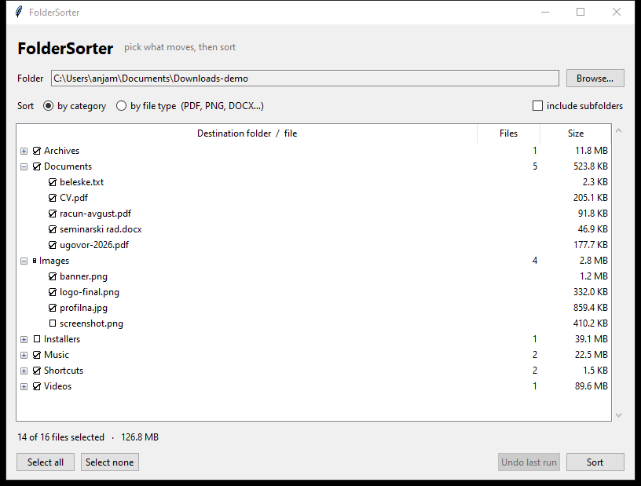

# FolderSorter

A small, dependency-free Python tool that tidies up a messy folder. It looks at every file, works out where it belongs from its extension, and moves it into a folder of that name — `Images/`, `Documents/`, `Music/`, or, if you prefer, `PDF/`, `PNG/`, `DOCX/`.

It comes in two halves: a **window** for picking exactly what moves, and a **command line** version for when you just want it done. Both are careful by default, and every run can be reversed with one click or one `--undo`.



## Features

- Two ways to group files: **by category** (Images, Documents, Music, Videos, Archives, Installers, Code, Fonts, Shortcuts, Other) or **by file type** — one folder per extension
- **Pick what moves.** The window lists everything grouped by destination, with tick boxes on both the group and each individual file, and shows how much space each group takes
- **Undo.** Every sort writes a small log file, so the whole thing can be put back exactly as it was
- **Never overwrites.** A name clash becomes `photo (1).jpg`, `photo (2).jpg`, …
- **Safe to run twice.** Files already sitting in the right folder are left alone
- **`--dry-run`** to preview from the terminal without being asked anything
- **Include subfolders** to pull files up out of the folders they are buried in
- Skips hidden files and folders (`.git`, dotfiles) and OS clutter (`desktop.ini`, `Thumbs.db`) — and never moves itself
- One locked or in-use file doesn't abort the run; it's reported at the end
- Colorful terminal output with an ASCII-art logo, switched off automatically when piping to a file
- Standard library only — nothing to install

## Requirements

- Python 3.7+

No third-party packages. `tkinter`, which draws the window, ships with Python. Works on **Windows, macOS, and Linux**.

## Usage

### The window

```bash
python gui.py
```

On Windows use `pythonw gui.py` to launch it without a console window sitting behind it.

Pick a folder with **Browse…**, choose whether to group by category or by file type, untick anything you want left where it is, then press **Sort**. It asks once more before moving anything. **Undo last run** puts everything back. The folder and options you used are remembered for next time.

### The command line

```bash
python organizer.py <folder> [options]
```

> **Linux / macOS:** use `python3` instead of `python`.

If you leave out the folder, it sorts the folder you are currently in.

| Option | Description | Default |
| --- | --- | --- |
| `folder` | Folder to organize (positional) | current folder |
| `--dry-run` | Only show the plan; never ask, never move | off |
| `-y`, `--yes` | Skip the confirmation prompt | asks first |
| `--undo` | Put back everything the last run moved | — |
| `-e`, `--by-extension` | One folder per file type (`PDF`, `PNG`) instead of categories | by category |
| `-r`, `--recursive` | Also pull files out of subfolders | top level only |
| `--no-color` | Disable colored output | colors on (if terminal) |
| `--no-logo` | Hide the ASCII-art logo | logo shown |

### Examples

```bash
# See what would happen to your Downloads folder, without being asked anything
python organizer.py ~/Downloads --dry-run

# Sort the Desktop (shows the plan, then asks for confirmation)
python organizer.py C:\Users\me\Desktop

# One folder per file type, subfolders included, no prompt
python organizer.py ~/Downloads --by-extension -r -y

# Changed your mind
python organizer.py ~/Downloads --undo
```

### Sample output

In a real terminal the logo has a cyan→blue gradient and the destinations are green; here is the plain-text shape:

```
    ______        __     __           _____              __
   / ____/____   / /____/ /___   ____/ ___/ ____   ____ / /_ ___   ____
  / /_   / __ \ / // __  // _ \ / __/\__ \ / __ \ / __// __// _ \ / __/
 / __/  / /_/ // // /_/ //  __// /  ___/ // /_/ // /  / /_ /  __// /
/_/     \____//_/ \__,_/ \___//_/  /____/ \____//_/   \__/ \___//_/
                                                          by @anjomozda

  Folder   C:\Users\me\Desktop
  Plan     24 files   ·   9 folders by category   ·   top level only

  FILE                                        DESTINATION
  ──────────────────────────────────────────────────────────────────────
  ● arhiva.zip                                Archives/
  ● cv.pdf                                    Documents/
  ● Discord.lnk                               Shortcuts/
  ● logo.png                                  Images/
  ● pesma.mp3                                 Music/
  ● reportaza.mp4                             Videos/
  ● setup.exe                                 Installers/
  ● slika.png                                 Images/slika (1).png
  ● nesto.xyz                                 Other/

  Move 24 files? [y/N] y

  ✓ 24 moved   ·   0.1s
  Undo with:  python organizer.py "C:\Users\me\Desktop" --undo
```

## ⚠️ Safety

Moving files around in bulk is the kind of thing you want to be able to take back, so:

- **Nothing moves without a yes.** The command line prints the plan and waits for a `y`; the window asks in a dialog before it starts.
- **Use `--dry-run` first** on a folder you care about, to see exactly what would happen.
- **Undo reverses the last run** in that folder, using the `.foldersorter-log.json` file written next to your files. Deleting that log means the run can no longer be undone automatically.
- Only the **last** run is remembered — each sort replaces the previous log.
- **Include subfolders** empties out your subfolders into the destination folders. That's the point, but it's a bigger change than the default, so preview it first.

## How it works

`organizer.py` holds all of the logic and the command line; `gui.py` only draws the window and calls into it. Nothing about deciding, moving or undoing is written twice.

The category table is flattened once into a plain `{".png": "Images", ...}` dictionary, so classifying a file is a single dict lookup on `Path.suffix`. In `--by-extension` mode the folder name is just that suffix in capitals. Anything unrecognised — or with no extension at all — goes to `Other/`.

The complete list of `(source, destination)` pairs is built **before** anything moves. Destinations are checked against both the disk and the names already handed out during this run, which is what stops two files called `slika.png` from different subfolders from colliding with each other. A file that already sits in the folder it would be moved to is dropped from the plan entirely — that one check is what makes a second run report "nothing to do" instead of building `Images/Images/`, in either mode.

Files are moved with `shutil.move` rather than `os.rename`, so moving across drives works, and each move is wrapped individually — a single locked file gets reported instead of aborting the run. The successful moves are then written to `.foldersorter-log.json`, and undo walks that list backwards, moving every file back to the path it came from and removing the folders it emptied. Because those folder names are read back out of the log rather than from a fixed list, undo cleans up after a `PDF/`-style run just as well as a `Documents/`-style one.
